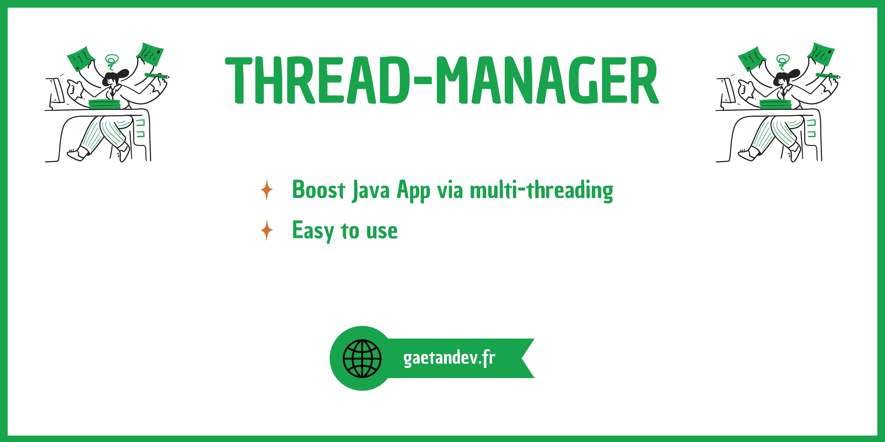

ThreadManager class
============
> ThreadManager is a class that makes it easy to use multi-threading on your java projects, without worrying about exceeding the maximum number of threads.

How it works ?
============
> In the ``example`` package you get an idea of how you should instantiate the ``ThreadManager`` class.
[Here](https://github.com/GaetanOff/ThreadManager/blob/master/src/com/gaetan/threadmanager/example/MainExample.java)
> 
>/!\ You must instantiate the ThreadManager class only once in your code.
>
Example
============

```java
this.threadManager.getThreadPool().execute(() -> {
    System.out.println("This will be executed outside the main thread.");
});
```

Scheduled
```java
this.threadManager.getThreadScheduledPool().scheduleAtFixedRate(() -> {
    System.out.println("This will be sent every second. And outside of the main thread.");
}, 0, 1, TimeUnit.SECONDS);
```

```java
this.threadManager.getThreadScheduledPool().scheduleAtFixedRate(() -> {
    System.out.println("This will be sent every hour. And outside of the main thread.");
}, 0, 1, TimeUnit.HOURS);
```

License
============

All the code is licensed under GPL v3.

```
ThreadManager: Boost Java App via multi-threading.

This program is free software: you can redistribute it and/or modify
it under the terms of the GNU General Public License as published by
the Free Software Foundation, version 3 of the License.

This program is distributed in the hope that it will be useful,
but WITHOUT ANY WARRANTY; without even the implied warranty of
MERCHANTABILITY or FITNESS FOR A PARTICULAR PURPOSE. See the
GNU General Public License for more details.

You should have received a copy of the GNU General Public License
along with this program. If not, see <https://www.gnu.org/licenses/>.
```
